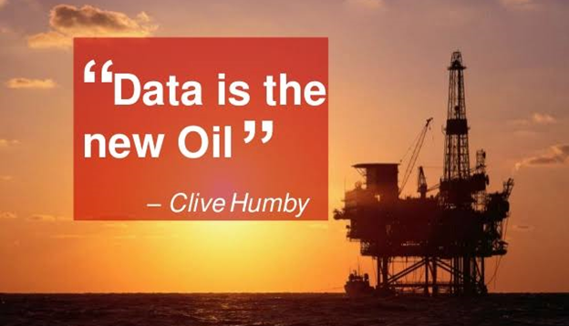

<h1>AlphaMine</h1>

<h3>Problem Statement</h3>

 Machine Learning has gained traction in recent years. However, training and validating machine learning requires the availability of labeled data at scale. The new demands of data ensure that data collection will always be a consistent struggle. 

<h3>Text Mining</h3>

For mining text datasets, we use a set number of classes, each consisting of a .txt file with text from an amount of webpages.

<h3>Image Mining</h3>

 In order to mine our image datasets, we use a set number of classes, with a set amount of images per class. These images can be sized uniformly and gray scaled. We also have a feature that creates bounding boxes on images. These bounding boxes are stored in the meta_images.json/p>
<h3>Installation Instructions</h3>
<h3>Command-Line Usage</h3>
<h3>Library Usage</h3>
